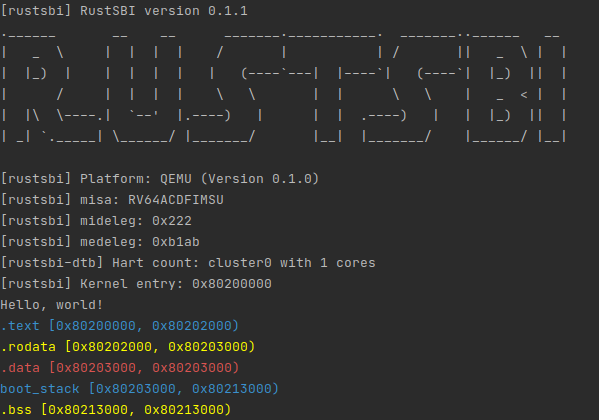

# lab1

## 编程内容总结

* 实现了 linker_qemu.ld，定义链接时的布局；
* 实现了 entry.asm，在其中定义了 \_start 函数用于初始化，正确配置了栈空间布局并跳转到 rust\_main 函数；
* 实现了 sbi.rs，通过汇编语句调用 rustsbi 以实现 putchar 和 shutdown 等功能；
* 实现了 log.rs，实现彩色打印宏；
* 实现了 main.rs，在 rust_main 函数中实现了打印 `Hello,world!` 以及打印内存布局的功能。

## 截图

## 问题回答

### 1

mideleg 和 medeleg 分别控制将哪些中断/同步异常委托给 S 模式。寄存器值：mideleg 为 0x222，medeleg 为 0xb1ab，如下所示：

### 2

* 第一条指令位于 0x1000；
* 经过若干次单条指令执行后跳转到 0x80000000，此时进入了 rustsbi 的 start 函数，首先进行 hart_id 相关的处理；
* 接下来跳转到 rustsbi 的 main 函数，进行进入 S 态之前的若干初始化；
* 最后跳转到 0x80200000，在 S 态下运行操作系统代码。

