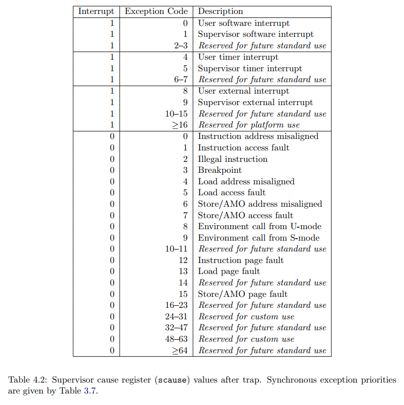

# lab2

## 编程内容总结

* 加入 user 目录用于生成用户程序，并且调整 build.rs 中的 TARGET_PATH 为 `../user/build/bin/` 更方便地使用具体章节测例；
* 加入 trap 相关内容，设置 stvec 使得每次 trap 时进入 \_\_alltraps 进行上下文保存，其中 \_\_alltraps 为我们书写的汇编代码（在 `trap.S` 中），最后会跳转到 trap_handler 这个 rust 函数进行实际的 trap 处理；
* 加入 batch 相关内容，在其中定义 4K 对齐的用户栈和内核栈，并利用 AppManager 进行不同应用程序的依次载入和执行，具体开始执行时将构造的 TrapContext 压入内核栈再使用 \_\_restore 汇编代码进行跳转。

## 简答题

### 1

版本：RustSBI version 0.1.1

#### _ch2_bad_instruction.bin

```
[rustsbi-panic] hart 0 panicked at 'invalid instruction, mepc: 000000008040005c, instruction: 0000000010200073', platform/qemu/src/main.rs:458:17
[rustsbi-panic] system shutdown scheduled due to RustSBI panic
```

提示错误信息 `invalid instruction`，即非法指令，并且退出程序。

#### _ch2_bad_register.bin

```
[rustsbi-panic] hart 0 panicked at 'invalid instruction, mepc: 000000008040005e, instruction: 0000000010002573', platform/qemu/src/main.rs:458:17
[rustsbi-panic] system shutdown scheduled due to RustSBI panic
```

提示错误信息 `invalid instruction`，即非法指令，并且退出程序。

#### _ch2t_bad_address.bin

```
[kernel] PageFault in application, core dumped.
[kernel] Panicked at src/batch.rs:61 All applications completed!
```

提示错误信息 `PageFault`。

### 2

#### 2.1

a0 代表内核栈栈顶。

* 其中一种使用场景即从内核态通过构造的 TrapContext 运行用户程序，此时传入的 a0 即该 TrapContext 压入栈后的首地址（低地址），也就是内核栈的栈顶；
* 另外一种使用场景即处理完毕 trap 之后回到用户态，需要注意在 \_\_alltraps 中将 TrapContext 压入内核栈之后，将 a0 赋值为了该 TrapContext 压入栈后的首地址（低地址），也就是内核栈的栈顶。

#### 2.2

特殊处理了 sstatus、sepc、sscratch 三个寄存器的恢复。

* sstatus：存储进入 trap 之前 CPU 处在哪个特权级等信息；
* sepc：当 trap 是一个异常的时候，记录 trap 发生之前执行的最后一条指令的地址；
* sscratch：平时存储内核栈栈顶，在 \_\_restore 和 \_\_alltraps 过程中作为中转寄存器。

#### 2.3

* x2(sp) 在最后进行恢复，因为当时的 sp 还要作为内核栈栈顶使用；
* x4(tp) 除非手动出于一些特殊用途使用，否则一般不会被用到，所以无需保存和恢复。

#### 2.4

指令之后， sp 为用户栈栈顶，sscratch 为内核栈栈顶。

#### 2.5

sret 指令中发生了状态切换，因为 sstatus 中记录了 trap 之前的状态为用户态，所以执行 sret 时会进入用户态。

#### 2.6

指令之后， sp 为内核栈栈顶，sscratch 为用户栈栈顶。

#### 2.7

调用 ecall 或是发生异常时从 U 态进入 S 态。

### 3

risc64 支持的中断/异常如下所示（图片来源 The RISC-V Instruction Set Manual Volume II: Privileged Architecture Document Version 20190608-Priv-MSU-Ratified）：



通过 scause 的首位为 0/1 判断，1 即中断，0 即异常。

陷入内核时的几个重要寄存器：

* sstatus：一些重要的状态信息；
* sepc：返回时跳转到的 pc；
* stvec：发生异常时需要跳转到的地址；
* scause：发生异常的种类；
* sscratch：重要的中转寄存器；
* stval：附加信息，包括地址异常中出错的地址，非常指令时异常的指令等。

### 4

并不一定，可以考虑根据不同的中断类型来保存相应的寄存器集合。

