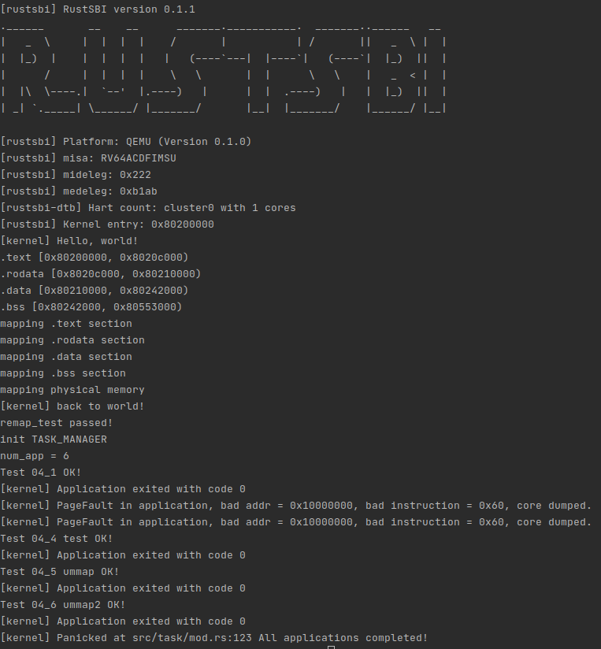

# lab4

## 编程内容总结

* 新增 mm 模块，增加全局分配器、堆分配器，地址空间、页表、页表项等结构体；
* 修改 translated_byte_buffer 以支持标志位检查，进而处理 sys_write 的合法性判定；
* 合并 stride 与本章对于 task 的修改，并且修改了 trap 相关内容，使得在存在地址空间的情况下可以正确执行；
* 加入 mmap 和 munmap 的系统调用支持，并且在 memory_set 中完成了相应实现；
* 修改了应用载入等其它杂项。

第四章测例如下：

之前 lab 的测例也可通过，但是非本章的主要工作，这里就不再展示了。另外注意 **在 /os/ 目录下 make run 时会自动编译并执行 /user/src/bin/ 下的代码**，而与 `/user/build/` 目录无关。

## 简答题

### 1

页表项的 [63:54] 这 10 位为保留地址，[53:10] 这 44 位是物理页号，[9:8] 这两位为 S 态保留使用。

剩下的 8 位从高到低为：

* D：Dirty，从上次置零起是否被修改过，可以用于实现 TLB 的不同写策略等；
* A：Accessed，从上次置零起是否被访问过，可以用于实现 TLB 的不同置换策略等；
* G：Global；
* U：User，是否允许 U 态访问；
* X/W/R：是否允许取指/写/读，用于控制不同权限；
* V：Valid，页表项是否合法。

### 2

#### (1)

Instruction page fault、Load page fault、Store/AMO page fault 这三种异常。

#### (2)

发生缺页异常时，虚拟地址将会被保存到 stval 寄存器中，并陷入内核态，而陷入内核时的几个重要寄存器：

* sstatus：一些重要的状态信息；
* sepc：返回时跳转到的 pc；
* stvec：发生异常时需要跳转到的地址；
* scause：发生异常的种类；
* sscratch：重要的中转寄存器；
* stval：附加信息，这里即发生缺页异常的虚拟地址。

#### (3)

好处即节省时间和内存空间，对于一个较大的程序，有可能只会使用其中的一小部分代码，这时全部载入只会白白占用内存和消耗载入时间。

#### (4)

考虑每一页是 4K，则大约有 10G/4K = 2.5M 个页表项（这里算数量级故只考虑第三级页表），于是实际大致占用 2.5M*8B = 20M 字节内存。

#### (5)

当申请时并不实际申请物理内存，而是用标记的形式占用虚拟内存，当第一次使用，发生缺页异常时确认有分配标记才实际 map 到物理内存上去。

#### (6)

页面失效后，valid 位会被置 0。

### 3

#### (1)

只需要更改 satp 寄存器的值即可。

#### (2)

将 User 位置 0 即可。

#### (3)

便于内核态与用户态数据的传递，并且减少更换页表的开销（更换页表会导致 TLB 被清空等）。

#### (4)

双页表实现下，会在内核态与用户态的切换中更换页表。如果要写一个单页表操作系统，我会选择在切换进程时更换页表（不同进程应当有不同地址空间）。