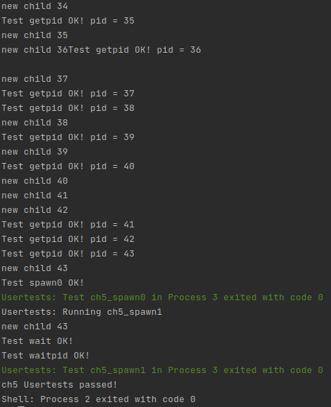

# lab5

## 编程内容总结

* 重构了进程管理模块，增加 TaskManager、Processor、Pid 等结构体；
* 加入初始进程 initproc 作为创建的第一个进程，并在此基础上创建 user_shell 子进程；
* 加入 fork、exec、spawn、waitpid 等系统调用。

运行 ch5_usertest 如下（仅截取了最后一部分）：



## 简答题

###　１

使用 COW (Copy On Write) 策略，当 fork 时并不进行实际的复制，而是在实际 write 的时候才进行实际的复制。

### 2

论文中给出了 fork 的一些问题，这里列出部分：

* fork 已经不再像一开始那样简单；
* fork 不是线程安全的；
* fork 安全性较差；
* fork 速度很慢。

### 3

```rust
// file: add
use std::env;

pub fn main() -> isize {
    let mut arguments = Vec::new();
    for argument in env::args() {
        arguments.push(argument);
    }
    let b = get_b();
    println!("a + b = {}", arguments[1] + b);
    0
}

// file: main
fn main() -> isize {
    let a = get_a();
    spawn("add", a);
    println!("a = {}", a);
    0
}
```

fork 的好处：

* 不需要手动进行参数传递；
* 代码简洁，可以写在同一份代码中，而不需要另开文件。

### 4

如下所示：

```rust
pub enum TaskStatus {
    Ready,
    Running,
    Zombie,
}
```

包括 Ready、Running、Zombie 三种状态。

* Ready 表示已经进程已经准备好运行； 
* Running 表示进程正在运行中；
* Zombie 表示进程已结束，等待回收资源。

几种操作对于状态的影响如下：

* fork: 产生一个为 Ready 状态的新进程，当前进程状态仍为 Running；
* exec: 不改变当前进程的状态，仍为 Running 态，但会改变执行的程序；
* wait: 等待当前进程的某个子进程（若存在）进入 Zombie 态并回收，而当前进程暂时进入 Ready 态；
* exit: 当前进程从 Running 态进入 Zombie 态。