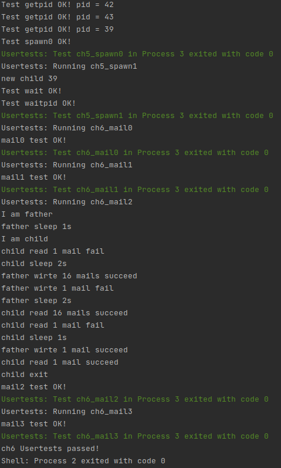

# lab6

## 编程内容总结

* 加入了 fs 模块，加入 PipeRingBuffer 等结构，增加对管道和标准输入输出的支持；
* 向任务控制块中增加文件描述符表，用于存储和管理当前打开的文件；
* 增加 pipe 和 close 等系统调用；
* 增加 MailBox 和 Mail 等结构体，增加基于邮件机制的通信接口 mailread 和 mailwrite。

运行 ch6_usertest 如下（仅截取了最后一部分）：

## 简答题

###　１

