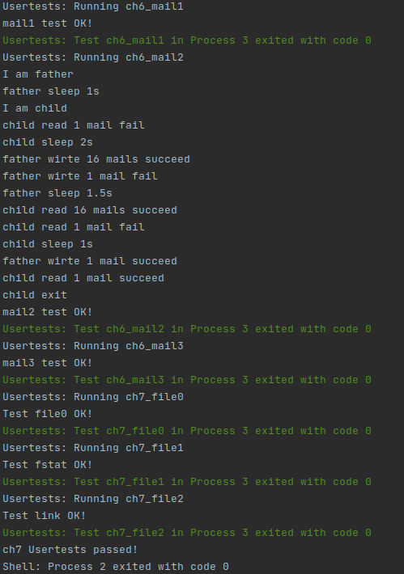

# lab7

## 编程内容总结

* 加入了 easy-fs 以及 easy-fs-fuse;
* 删除了 loader.rs，改为使用文件系统进行读入；
* 更改 exec 等接口，增加了命令行参数的处理；
* 增加了 SYSCALL_DUP 以及输入输出重定向的处理；
* 重构 FdTable，加入 FdTableEntry，加入硬链接相关系统调用。

运行 ch7_usertest 如下（仅截取了最后一部分）：



## 简答题

### １

整体来看同现在的实现不会有本质上的差异，可能需要实现的有：

* 支持创建和删除目录，其中删除目录可以支持递归删除（相当于 rm -r）；
* 增加对绝对路径和相对路径的解析和处理。

### 2

在 Ubuntu 18.04 上进行测试。

测试时建立目录 `A/B/`，并在此目录下对目录 A 建立链接 C。另外在 `A/` 目录下建立文件 `tmp.txt`。

#### 硬链接

```
yyr@yyr-virtual-machine:~/Work/loop_test$ mkdir A
yyr@yyr-virtual-machine:~/Work/loop_test$ cd A
yyr@yyr-virtual-machine:~/Work/loop_test/A$ touch tmp.txt
yyr@yyr-virtual-machine:~/Work/loop_test/A$ mkdir B
yyr@yyr-virtual-machine:~/Work/loop_test/A$ cd B
yyr@yyr-virtual-machine:~/Work/loop_test/A/B$ ln ../../A C
ln: ../../A: hard link not allowed for directory
```

系统不允许对目录进行硬链接。

#### 软链接

```
yyr@yyr-virtual-machine:~/Work/loop_test$ mkdir A
yyr@yyr-virtual-machine:~/Work/loop_test$ cd A
yyr@yyr-virtual-machine:~/Work/loop_test/A$ touch tmp.txt
yyr@yyr-virtual-machine:~/Work/loop_test/A$ mkdir B
yyr@yyr-virtual-machine:~/Work/loop_test/A$ cd B
yyr@yyr-virtual-machine:~/Work/loop_test/A/B$ ln -s ../../A C
yyr@yyr-virtual-machine:~/Work/loop_test/A/B$ ls
C
```

可以发现建立软链接成功，试着递归进入目录：

```
yyr@yyr-virtual-machine:~/Work/loop_test/A/B$ cd C
yyr@yyr-virtual-machine:~/Work/loop_test/A/B/C$ cd B
yyr@yyr-virtual-machine:~/Work/loop_test/A/B/C/B$ cd C
yyr@yyr-virtual-machine:~/Work/loop_test/A/B/C/B/C$ cd B
yyr@yyr-virtual-machine:~/Work/loop_test/A/B/C/B/C/B$ cd C
yyr@yyr-virtual-machine:~/Work/loop_test/A/B/C/B/C/B/C$
```

成功递归进入目录，试着 ls：

```
yyr@yyr-virtual-machine:~/Work/loop_test/A/B/C/B/C/B/C$ ls
B  tmp.txt
```

成功。

#### 总结

* 硬链接的 inode 与被链接文件/目录的 inode 相同，不允许对目录创建硬链接，避免了出现环；
* 软链接也即符号链接，可以理解为仅存储了路径，可以出现环，也可以对不存在的文件创建软链接。