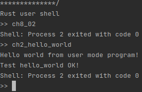
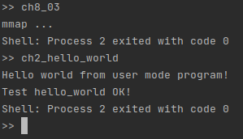
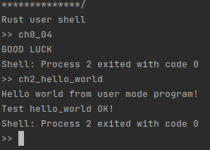

# lab8

## 说明

如果编译出错或是修改了 user/ 下的代码，请先 `make clean` 再 `make run`。

## ch8_01

### 运行和分析

运行发生崩溃，如下：

```
Panicked at src/mm/memory_set.rs:316 called `Option::unwrap()` on a `None` value
```

这行代码为：

```rust
let frame = frame_alloc().unwrap();
```

此时是因为分配 frame 失败（无剩余可分配 frame）导致的错误，一个比较合理的解决办法是在 fork 之前确定 fork 所需要的 frame 数目，如果大于剩余可分配数则 fork 返回 -1。

### 编程实现

为了方便展示，在 user_shell 代码中增加每次输入回车则暂停 1 秒的语句。

关键部分代码如下：

```rust
// task/task.rs  TaskControlBlock::fork
if frame_remaining() < KERNEL_STACK_SIZE / PAGE_SIZE + parent_inner.memory_set.get_frame_num() {  // KERNEL + PARENT (Trampoline and page table are included)
    None
} 

// mm.frame_allocator.rs
pub fn frame_remaining() -> usize {
    FRAME_ALLOCATOR.lock().remaining
}

// mm/memory_set.rs  MemorySet::get_frame_num 
pub fn get_frame_num(&self) -> usize {
    let mut ret = self.page_table.get_frame_num();
    for x in self.areas.iter() {
        ret += x.vpn_range.get_end().0 - x.vpn_range.get_start().0;
    }
    ret
}

// mm/page_table.rs  PageTable::get_frame_num
pub fn get_frame_num(&self) -> usize {
    self.frames.len()
}
```

注意需要在 alloc 和 dealloc 时分别对 FRAME_ALLOCATOR 的 remaing 进行加 1 和减 1 操作。

运行结果如下：

```
>> ch8_01
Shell: Process 2 exited with code 0
[initproc] Released a zombie process, pid=3, exit_code=0
[initproc] Released a zombie process, pid=5, exit_code=0
[initproc] Released a zombie process, pid=4, exit_code=0
[initproc] Released a zombie process, pid=6, exit_code=0
[initproc] Released a zombie process, pid=7, exit_code=0
[initproc] Released a zombie process, pid=8, exit_code=0
[initproc] Released a zombie process, pid=9, exit_code=0
[initproc] Released a zombie process, pid=10, exit_code=0
[initproc] Released a zombie process, pid=11, exit_code=0
[initproc] Released a zombie process, pid=12, exit_code=0
[initproc] Released a zombie process, pid=2, exit_code=0
[initproc] Released a zombie process, pid=13, exit_code=0
[initproc] Released a zombie process, pid=14, exit_code=0
[initproc] Released a zombie process, pid=15, exit_code=0
[initproc] Released a zombie process, pid=17, exit_code=0
[initproc] Released a zombie process, pid=18, exit_code=0
[initproc] Released a zombie process, pid=19, exit_code=0
[initproc] Released a zombie process, pid=20, exit_code=0
[initproc] Released a zombie process, pid=25, exit_code=0
[initproc] Released a zombie process, pid=26, exit_code=0
[initproc] Released a zombie process, pid=27, exit_code=0
[initproc] Released a zombie process, pid=28, exit_code=0
[initproc] Released a zombie process, pid=29, exit_code=0
[initproc] Released a zombie process, pid=30, exit_code=0
[initproc] Released a zombie process, pid=31, exit_code=0
[initproc] Released a zombie process, pid=32, exit_code=0
[initproc] Released a zombie process, pid=16, exit_code=0
[initproc] Released a zombie process, pid=24, exit_code=0
[initproc] Released a zombie process, pid=33, exit_code=0
[initproc] Released a zombie process, pid=34, exit_code=0
[initproc] Released a zombie process, pid=35, exit_code=0
[initproc] Released a zombie process, pid=36, exit_code=0
[initproc] Released a zombie process, pid=37, exit_code=0
[initproc] Released a zombie process, pid=38, exit_code=0
[initproc] Released a zombie process, pid=39, exit_code=0
[initproc] Released a zombie process, pid=40, exit_code=0
[initproc] Released a zombie process, pid=41, exit_code=0
[initproc] Released a zombie process, pid=42, exit_code=0
[initproc] Released a zombie process, pid=43, exit_code=0
[initproc] Released a zombie process, pid=44, exit_code=0
[initproc] Released a zombie process, pid=45, exit_code=0
[initproc] Released a zombie process, pid=46, exit_code=0
[initproc] Released a zombie process, pid=47, exit_code=0
[initproc] Released a zombie process, pid=48, exit_code=0
[initproc] Released a zombie process, pid=49, exit_code=0
[initproc] Released a zombie process, pid=50, exit_code=0
[initproc] Released a zombie process, pid=51, exit_code=0
[initproc] Released a zombie process, pid=5, exit_code=0
[initproc] Released a zombie process, pid=3, exit_code=0
[initproc] Released a zombie process, pid=52, exit_code=0
[initproc] Released a zombie process, pid=53, exit_code=0
[initproc] Released a zombie process, pid=54, exit_code=0
[initproc] Released a zombie process, pid=55, exit_code=0
[initproc] Released a zombie process, pid=56, exit_code=0
[initproc] Released a zombie process, pid=57, exit_code=0
[initproc] Released a zombie process, pid=58, exit_code=0
[initproc] Released a zombie process, pid=59, exit_code=0
[initproc] Released a zombie process, pid=60, exit_code=0
[initproc] Released a zombie process, pid=61, exit_code=0
[initproc] Released a zombie process, pid=62, exit_code=0
[initproc] Released a zombie process, pid=63, exit_code=0
[initproc] Released a zombie process, pid=64, exit_code=0
[initproc] Released a zombie process, pid=65, exit_code=0
[initproc] Released a zombie process, pid=66, exit_code=0
[initproc] Released a zombie process, pid=67, exit_code=0
[initproc] Released a zombie process, pid=68, exit_code=0
[initproc] Released a zombie process, pid=69, exit_code=0
[initproc] Released a zombie process, pid=70, exit_code=0
[initproc] Released a zombie process, pid=71, exit_code=0
[initproc] Released a zombie process, pid=72, exit_code=0
[initproc] Released a zombie process, pid=73, exit_code=0
[initproc] Released a zombie process, pid=74, exit_code=0
[initproc] Released a zombie process, pid=75, exit_code=0
[initproc] Released a zombie process, pid=78, exit_code=0
[initproc] Released a zombie process, pid=79, exit_code=0
[initproc] Released a zombie process, pid=80, exit_code=0
[initproc] Released a zombie process, pid=81, exit_code=0
[initproc] Released a zombie process, pid=82, exit_code=0
[initproc] Released a zombie process, pid=83, exit_code=0
[initproc] Released a zombie process, pid=84, exit_code=0
[initproc] Released a zombie process, pid=85, exit_code=0
[initproc] Released a zombie process, pid=86, exit_code=0
[initproc] Released a zombie process, pid=87, exit_code=0
[initproc] Released a zombie process, pid=88, exit_code=0
[initproc] Released a zombie process, pid=89, exit_code=0
[initproc] Released a zombie process, pid=90, exit_code=0
[initproc] Released a zombie process, pid=91, exit_code=0
[initproc] Released a zombie process, pid=92, exit_code=0
[initproc] Released a zombie process, pid=93, exit_code=0
[initproc] Released a zombie process, pid=94, exit_code=0
[initproc] Released a zombie process, pid=95, exit_code=0
[initproc] Released a zombie process, pid=96, exit_code=0
[initproc] Released a zombie process, pid=97, exit_code=0
[initproc] Released a zombie process, pid=98, exit_code=0
[initproc] Released a zombie process, pid=99, exit_code=0
[initproc] Released a zombie process, pid=100, exit_code=0
[initproc] Released a zombie process, pid=101, exit_code=0
[initproc] Released a zombie process, pid=21, exit_code=0
[initproc] Released a zombie process, pid=22, exit_code=0
[initproc] Released a zombie process, pid=23, exit_code=0
[initproc] Released a zombie process, pid=102, exit_code=0
[initproc] Released a zombie process, pid=103, exit_code=0
[initproc] Released a zombie process, pid=104, exit_code=0
[initproc] Released a zombie process, pid=105, exit_code=0
[initproc] Released a zombie process, pid=106, exit_code=0
[initproc] Released a zombie process, pid=109, exit_code=0
[initproc] Released a zombie process, pid=110, exit_code=0
[initproc] Released a zombie process, pid=111, exit_code=0
[initproc] Released a zombie process, pid=112, exit_code=0
[initproc] Released a zombie process, pid=113, exit_code=0
[initproc] Released a zombie process, pid=114, exit_code=0
[initproc] Released a zombie process, pid=115, exit_code=0
[initproc] Released a zombie process, pid=116, exit_code=0
[initproc] Released a zombie process, pid=117, exit_code=0
[initproc] Released a zombie process, pid=118, exit_code=0
[initproc] Released a zombie process, pid=119, exit_code=0
[initproc] Released a zombie process, pid=120, exit_code=0
[initproc] Released a zombie process, pid=121, exit_code=0
[initproc] Released a zombie process, pid=122, exit_code=0
[initproc] Released a zombie process, pid=123, exit_code=0
[initproc] Released a zombie process, pid=124, exit_code=0
[initproc] Released a zombie process, pid=125, exit_code=0
[initproc] Released a zombie process, pid=126, exit_code=0
[initproc] Released a zombie process, pid=127, exit_code=0
[initproc] Released a zombie process, pid=128, exit_code=0
[initproc] Released a zombie process, pid=129, exit_code=0
[initproc] Released a zombie process, pid=130, exit_code=0
[initproc] Released a zombie process, pid=133, exit_code=0
[initproc] Released a zombie process, pid=32, exit_code=0
[initproc] Released a zombie process, pid=31, exit_code=0
[initproc] Released a zombie process, pid=30, exit_code=0
[initproc] Released a zombie process, pid=29, exit_code=0
[initproc] Released a zombie process, pid=28, exit_code=0
[initproc] Released a zombie process, pid=27, exit_code=0
[initproc] Released a zombie process, pid=26, exit_code=0
[initproc] Released a zombie process, pid=25, exit_code=0
[initproc] Released a zombie process, pid=20, exit_code=0
[initproc] Released a zombie process, pid=19, exit_code=0
[initproc] Released a zombie process, pid=18, exit_code=0
[initproc] Released a zombie process, pid=17, exit_code=0
[initproc] Released a zombie process, pid=15, exit_code=0
[initproc] Released a zombie process, pid=14, exit_code=0
[initproc] Released a zombie process, pid=13, exit_code=0
[initproc] Released a zombie process, pid=2, exit_code=0
[initproc] Released a zombie process, pid=12, exit_code=0
[initproc] Released a zombie process, pid=11, exit_code=0
[initproc] Released a zombie process, pid=10, exit_code=0
[initproc] Released a zombie process, pid=9, exit_code=0
[initproc] Released a zombie process, pid=8, exit_code=0
[initproc] Released a zombie process, pid=7, exit_code=0
[initproc] Released a zombie process, pid=6, exit_code=0
[initproc] Released a zombie process, pid=4, exit_code=0
[initproc] Released a zombie process, pid=134, exit_code=0
[initproc] Released a zombie process, pid=135, exit_code=0
[initproc] Released a zombie process, pid=136, exit_code=0
[initproc] Released a zombie process, pid=76, exit_code=0
[initproc] Released a zombie process, pid=77, exit_code=0
[initproc] Released a zombie process, pid=137, exit_code=0
[initproc] Released a zombie process, pid=138, exit_code=0
[initproc] Released a zombie process, pid=139, exit_code=0
[initproc] Released a zombie process, pid=140, exit_code=0
[initproc] Released a zombie process, pid=141, exit_code=0
[initproc] Released a zombie process, pid=142, exit_code=0
[initproc] Released a zombie process, pid=143, exit_code=0
[initproc] Released a zombie process, pid=144, exit_code=0
[initproc] Released a zombie process, pid=145, exit_code=0
[initproc] Released a zombie process, pid=146, exit_code=0
[initproc] Released a zombie process, pid=147, exit_code=0
[initproc] Released a zombie process, pid=148, exit_code=0
[initproc] Released a zombie process, pid=149, exit_code=0
[initproc] Released a zombie process, pid=150, exit_code=0
[initproc] Released a zombie process, pid=151, exit_code=0
[initproc] Released a zombie process, pid=153, exit_code=0
[initproc] Released a zombie process, pid=154, exit_code=0
[initproc] Released a zombie process, pid=155, exit_code=0
[initproc] Released a zombie process, pid=156, exit_code=0
[initproc] Released a zombie process, pid=157, exit_code=0
[initproc] Released a zombie process, pid=107, exit_code=0
[initproc] Released a zombie process, pid=108, exit_code=0
[initproc] Released a zombie process, pid=158, exit_code=0
[initproc] Released a zombie process, pid=159, exit_code=0
[initproc] Released a zombie process, pid=160, exit_code=0
[initproc] Released a zombie process, pid=161, exit_code=0
[initproc] Released a zombie process, pid=162, exit_code=0
[initproc] Released a zombie process, pid=163, exit_code=0
[initproc] Released a zombie process, pid=164, exit_code=0
[initproc] Released a zombie process, pid=165, exit_code=0
[initproc] Released a zombie process, pid=166, exit_code=0
[initproc] Released a zombie process, pid=167, exit_code=0
[initproc] Released a zombie process, pid=168, exit_code=0
[initproc] Released a zombie process, pid=169, exit_code=0
[initproc] Released a zombie process, pid=170, exit_code=0
[initproc] Released a zombie process, pid=171, exit_code=0
[initproc] Released a zombie process, pid=172, exit_code=0
[initproc] Released a zombie process, pid=131, exit_code=0
[initproc] Released a zombie process, pid=132, exit_code=0
[initproc] Released a zombie process, pid=49, exit_code=0
[initproc] Released a zombie process, pid=48, exit_code=0
[initproc] Released a zombie process, pid=47, exit_code=0
[initproc] Released a zombie process, pid=46, exit_code=0
[initproc] Released a zombie process, pid=45, exit_code=0
[initproc] Released a zombie process, pid=44, exit_code=0
[initproc] Released a zombie process, pid=43, exit_code=0
[initproc] Released a zombie process, pid=42, exit_code=0
[initproc] Released a zombie process, pid=41, exit_code=0
[initproc] Released a zombie process, pid=40, exit_code=0
[initproc] Released a zombie process, pid=39, exit_code=0
[initproc] Released a zombie process, pid=38, exit_code=0
[initproc] Released a zombie process, pid=37, exit_code=0
[initproc] Released a zombie process, pid=36, exit_code=0
[initproc] Released a zombie process, pid=35, exit_code=0
[initproc] Released a zombie process, pid=34, exit_code=0
[initproc] Released a zombie process, pid=33, exit_code=0
[initproc] Released a zombie process, pid=24, exit_code=0
[initproc] Released a zombie process, pid=16, exit_code=0
[initproc] Released a zombie process, pid=173, exit_code=0
[initproc] Released a zombie process, pid=174, exit_code=0
[initproc] Released a zombie process, pid=176, exit_code=0
[initproc] Released a zombie process, pid=177, exit_code=0
[initproc] Released a zombie process, pid=178, exit_code=0
[initproc] Released a zombie process, pid=179, exit_code=0
[initproc] Released a zombie process, pid=180, exit_code=0
[initproc] Released a zombie process, pid=181, exit_code=0
[initproc] Released a zombie process, pid=182, exit_code=0
[initproc] Released a zombie process, pid=183, exit_code=0
[initproc] Released a zombie process, pid=184, exit_code=0
[initproc] Released a zombie process, pid=185, exit_code=0
[initproc] Released a zombie process, pid=186, exit_code=0
[initproc] Released a zombie process, pid=187, exit_code=0
[initproc] Released a zombie process, pid=188, exit_code=0
[initproc] Released a zombie process, pid=189, exit_code=0
[initproc] Released a zombie process, pid=190, exit_code=0
[initproc] Released a zombie process, pid=152, exit_code=0
[initproc] Released a zombie process, pid=191, exit_code=0
[initproc] Released a zombie process, pid=192, exit_code=0
[initproc] Released a zombie process, pid=193, exit_code=0
[initproc] Released a zombie process, pid=194, exit_code=0
[initproc] Released a zombie process, pid=196, exit_code=0
[initproc] Released a zombie process, pid=197, exit_code=0
[initproc] Released a zombie process, pid=198, exit_code=0
[initproc] Released a zombie process, pid=199, exit_code=0
[initproc] Released a zombie process, pid=200, exit_code=0
[initproc] Released a zombie process, pid=201, exit_code=0
[initproc] Released a zombie process, pid=202, exit_code=0
[initproc] Released a zombie process, pid=203, exit_code=0
[initproc] Released a zombie process, pid=61, exit_code=0
[initproc] Released a zombie process, pid=60, exit_code=0
[initproc] Released a zombie process, pid=59, exit_code=0
[initproc] Released a zombie process, pid=58, exit_code=0
[initproc] Released a zombie process, pid=57, exit_code=0
[initproc] Released a zombie process, pid=56, exit_code=0
[initproc] Released a zombie process, pid=55, exit_code=0
[initproc] Released a zombie process, pid=54, exit_code=0
[initproc] Released a zombie process, pid=53, exit_code=0
[initproc] Released a zombie process, pid=52, exit_code=0
[initproc] Released a zombie process, pid=3, exit_code=0
[initproc] Released a zombie process, pid=5, exit_code=0
[initproc] Released a zombie process, pid=51, exit_code=0
[initproc] Released a zombie process, pid=50, exit_code=0
[initproc] Released a zombie process, pid=204, exit_code=0
[initproc] Released a zombie process, pid=205, exit_code=0
[initproc] Released a zombie process, pid=206, exit_code=0
[initproc] Released a zombie process, pid=207, exit_code=0
[initproc] Released a zombie process, pid=208, exit_code=0
[initproc] Released a zombie process, pid=209, exit_code=0
[initproc] Released a zombie process, pid=210, exit_code=0
[initproc] Released a zombie process, pid=175, exit_code=0
[initproc] Released a zombie process, pid=212, exit_code=0
[initproc] Released a zombie process, pid=213, exit_code=0
[initproc] Released a zombie process, pid=214, exit_code=0
[initproc] Released a zombie process, pid=215, exit_code=0
[initproc] Released a zombie process, pid=216, exit_code=0
[initproc] Released a zombie process, pid=217, exit_code=0
[initproc] Released a zombie process, pid=218, exit_code=0
[initproc] Released a zombie process, pid=219, exit_code=0
[initproc] Released a zombie process, pid=220, exit_code=0
[initproc] Released a zombie process, pid=221, exit_code=0
[initproc] Released a zombie process, pid=222, exit_code=0
[initproc] Released a zombie process, pid=223, exit_code=0
[initproc] Released a zombie process, pid=195, exit_code=0
[initproc] Released a zombie process, pid=224, exit_code=0
[initproc] Released a zombie process, pid=225, exit_code=0
[initproc] Released a zombie process, pid=226, exit_code=0
[initproc] Released a zombie process, pid=65, exit_code=0
[initproc] Released a zombie process, pid=64, exit_code=0
[initproc] Released a zombie process, pid=63, exit_code=0
[initproc] Released a zombie process, pid=62, exit_code=0
[initproc] Released a zombie process, pid=227, exit_code=0
[initproc] Released a zombie process, pid=228, exit_code=0
[initproc] Released a zombie process, pid=229, exit_code=0
[initproc] Released a zombie process, pid=230, exit_code=0
[initproc] Released a zombie process, pid=231, exit_code=0
[initproc] Released a zombie process, pid=232, exit_code=0
[initproc] Released a zombie process, pid=233, exit_code=0
[initproc] Released a zombie process, pid=234, exit_code=0
[initproc] Released a zombie process, pid=235, exit_code=0
[initproc] Released a zombie process, pid=236, exit_code=0
[initproc] Released a zombie process, pid=237, exit_code=0
[initproc] Released a zombie process, pid=238, exit_code=0
[initproc] Released a zombie process, pid=239, exit_code=0
[initproc] Released a zombie process, pid=240, exit_code=0
[initproc] Released a zombie process, pid=211, exit_code=0
[initproc] Released a zombie process, pid=243, exit_code=0
[initproc] Released a zombie process, pid=244, exit_code=0
[initproc] Released a zombie process, pid=245, exit_code=0
[initproc] Released a zombie process, pid=246, exit_code=0
[initproc] Released a zombie process, pid=247, exit_code=0
[initproc] Released a zombie process, pid=248, exit_code=0
[initproc] Released a zombie process, pid=249, exit_code=0
[initproc] Released a zombie process, pid=250, exit_code=0
[initproc] Released a zombie process, pid=81, exit_code=0
[initproc] Released a zombie process, pid=80, exit_code=0
[initproc] Released a zombie process, pid=79, exit_code=0
[initproc] Released a zombie process, pid=78, exit_code=0
[initproc] Released a zombie process, pid=75, exit_code=0
[initproc] Released a zombie process, pid=74, exit_code=0
[initproc] Released a zombie process, pid=73, exit_code=0
[initproc] Released a zombie process, pid=72, exit_code=0
[initproc] Released a zombie process, pid=71, exit_code=0
[initproc] Released a zombie process, pid=70, exit_code=0
[initproc] Released a zombie process, pid=69, exit_code=0
[initproc] Released a zombie process, pid=68, exit_code=0
[initproc] Released a zombie process, pid=67, exit_code=0
[initproc] Released a zombie process, pid=66, exit_code=0
[initproc] Released a zombie process, pid=251, exit_code=0
[initproc] Released a zombie process, pid=252, exit_code=0
[initproc] Released a zombie process, pid=253, exit_code=0
[initproc] Released a zombie process, pid=254, exit_code=0
[initproc] Released a zombie process, pid=255, exit_code=0
[initproc] Released a zombie process, pid=241, exit_code=0
[initproc] Released a zombie process, pid=242, exit_code=0
[initproc] Released a zombie process, pid=256, exit_code=0
[initproc] Released a zombie process, pid=257, exit_code=0
[initproc] Released a zombie process, pid=258, exit_code=0
[initproc] Released a zombie process, pid=22, exit_code=0
[initproc] Released a zombie process, pid=21, exit_code=0
[initproc] Released a zombie process, pid=101, exit_code=0
[initproc] Released a zombie process, pid=100, exit_code=0
[initproc] Released a zombie process, pid=99, exit_code=0
[initproc] Released a zombie process, pid=98, exit_code=0
[initproc] Released a zombie process, pid=97, exit_code=0
[initproc] Released a zombie process, pid=259, exit_code=0
[initproc] Released a zombie process, pid=114, exit_code=0
>> ch2_hello_world
Hello world from user mode program!
Test hello_world OK!
Shell: Process 114 exited with code 0
>> 
```

在运行完毕之后又运行了 `ch2_hello_world` 确保系统没有崩溃，截取最后一部分的截图：


## ch8_02

### 运行和分析

同 ch8_01，仍然是出现了 frame 不足的问题，只需要在 mmap 中加入剩余量不足以分配时返回 -1 的判断即可。

### 编程实现

如下所示：

```rust
// mm/memory_set.rs MemorySet::mmap
if len / PAGE_SIZE > frame_remaining() {
    return -1;
}
```

运行结果：



同样运行了 ch2_hello_world 确保没有崩溃。

## ch8_03

### 运行和分析

出现错误：

```
[rustsbi-panic] hart 0 panicked at 'invalid instruction, mepc: 00000000000001e8, instruction: 0000000000330000', platform/qemu/src/main.rs:458:17
[rustsbi-panic] system shutdown scheduled due to RustSBI panic
```

可以发现，第一个 fstat 和 read 中用户代码中对不可写入的代码段进行了写入操作，而第二个 fstat 对可写入但不属于用户态可操作的地址进行了写入操作。

解决方案很简单，只需要在 translate 的过程中增加一个参数 `flags_needed: PTEFlags`，并用于权限检查即可。

### 编程实现

在 translate 相关函数（注意有若干个这样的函数）中加上语句：

```rust
if (pte.flags() & flags_needed) != flags_needed {
    // flags are not satisfied
    return None;
}
```

并且对 translate 相关的函数返回类型均套一层 `Option<>`，并在外层进行处理即可。

这里调用 fstat 和 read 时需要的 flag 均为 `PTEFlag:W | PTEFlag:U`，判断在不满足条件的情况下不进行写入。

运行结果如下：



同样运行了 ch2_hello_world 以确保没有崩溃。


## ch8_04

### 问题 1

运行看一下结果：

```
>> ch8_04
GOOD LUCK
[kernel] Panicked at src/fs/stdio.rs:39 Cannot read from stdout!
```

发现是在 read 时没有对 fd 进行可读性判断，加上判断即可，如下所示：

```rust
// syscall/fs.rs  sys_read
if !file.readable() {
    -1
} 
```

### 问题 2

可以看到接下来的几行 fd 很大，超出了 fd_table 大小，不过这个在之前的 lab 中已经得到了处理，类似如下：

```rust
if fd >= inner.fd_table.len() {
    return -1;
}
```

### 问题 3

接下来将 0、1、2 都 close 掉了，所以 println! 将不会输出，这个很显然已经正确处理了。

### 问题 4

再运行，结果如下：

```
>> ch8_04
GOOD LUCK
[kernel] Panicked at /home/yyr/Work/labs-2017011071/easy-fs/src/layout.rs:421 range end index 60 out of range for slice of length 28
```

判断是文件名过长，只需要在 open 中加入判断即可：

```rust
// fs/inode.rs  open_file
if name.len() > NAME_LENGTH_LIMIT {
    return None;
}
```

### 问题 5

link 中存在 new_path 为已有文件名的情况，解决如下：

```rust
// fs/inode.rs  linkat
if let Some(inode) = ROOT_INODE.find(newpath) {
    -1
}
```

另外 old_path 不存在和 old_path 与 new_path 相同等情况已经得到过处理。

### 问题 6

再次运行，发生如下错误：

```
[kernel] Panicked at src/syscall/fs.rs:147 index out of bounds: the len is 5 but the index is 313
```

即 fstat 没有对 fd 溢出进行处理，加上即可：

```rust
// syscall/fs.rs  sys_fstat
if fd >= inner.fd_table.len() {
    return -1;
}
```

另外 fstat 对为 None 的 fd 在之前已经正确处理了。

### 问题 7

最后两行的 linkat 和 unlinkat 使用了不正常的目录 fd，但由于目前的实现中为扁平结构，只有顶层目录，而 fd 被忽略，所以这里不正常的 fd 并不会导致错误。

### 运行结果



同样运行了 ch2_hello_world 以确保没有崩溃。