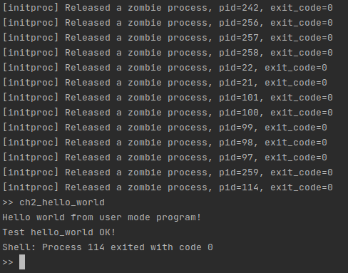

# lab8

## 说明

如果编译出错或是修改了 user/ 下的代码，请先 `make clean` 再 `make run`。

## ch8_01

### 运行和分析

运行发生崩溃，如下：

```
Panicked at src/mm/memory_set.rs:316 called `Option::unwrap()` on a `None` value
```

这行代码为：

```rust
let frame = frame_alloc().unwrap();
```

此时是因为分配 frame 失败（无剩余可分配 frame）导致的错误，一个比较合理的解决办法是当 frame 分配失败时直接退出进程。

### 编程实现

修改 StackFrameAllocator 中的 alloc 函数，使得在分配失败时调用 `exit_current_and_run_next(-1);`，这里的返回码直接使用了 -1。

#### 问题 1 及解决方案

但是这样一来会出现问题——之前在栈上分配的锁得不到解锁，从而造成死锁，这里使用一个不太安全的做法：

```rust
if self.current == self.end {
    unsafe {
        FRAME_ALLOCATOR.force_unlock();
        let task = current_task().unwrap();
        if task.is_inner_locked() {
            current_task().unwrap().force_unlock_inner();
        }
    }
    exit_current_and_run_next(-1);
    None
} 
```

即强制将 FRAME_ALLOCATOR 和 task inner 解锁。

#### 问题 2 及解决方案

除了分配了锁，还有引用计数的问题。在 wait_pid 中需要确认要回收的 child 引用计数只剩 1，之前是直接用 assert 来确保的，这里也采用了一个不太安全的做法：

```rust
unsafe {
    while Arc::strong_count(&child) > 1 {
        let raw = Arc::into_raw(child);
        Arc::decr_strong_count(raw);
        child = Arc::from_raw(raw);
    }
}
```

#### 运行结果

由于 user_shell 的 getchar() 为阻塞的，为了方便展示，在每次运行指令之后 sleep 了一秒，运行结果如下：

```
>> ch8_01
Shell: Process 2 exited with code 0
[initproc] Released a zombie process, pid=5, exit_code=0
[initproc] Released a zombie process, pid=6, exit_code=0
[initproc] Released a zombie process, pid=7, exit_code=0
[initproc] Released a zombie process, pid=8, exit_code=0
[initproc] Released a zombie process, pid=9, exit_code=0
[initproc] Released a zombie process, pid=11, exit_code=0
[initproc] Released a zombie process, pid=12, exit_code=0
[initproc] Released a zombie process, pid=3, exit_code=0
[initproc] Released a zombie process, pid=4, exit_code=0
[initproc] Released a zombie process, pid=10, exit_code=0
[initproc] Released a zombie process, pid=23, exit_code=0
[initproc] Released a zombie process, pid=24, exit_code=0
[initproc] Released a zombie process, pid=26, exit_code=0
[initproc] Released a zombie process, pid=27, exit_code=0
[initproc] Released a zombie process, pid=28, exit_code=0
[initproc] Released a zombie process, pid=29, exit_code=0
[initproc] Released a zombie process, pid=31, exit_code=0
[initproc] Released a zombie process, pid=32, exit_code=0
[initproc] Released a zombie process, pid=33, exit_code=0
[initproc] Released a zombie process, pid=22, exit_code=-1
[initproc] Released a zombie process, pid=25, exit_code=0
[initproc] Released a zombie process, pid=30, exit_code=-1
[initproc] Released a zombie process, pid=34, exit_code=0
[initproc] Released a zombie process, pid=35, exit_code=0
[initproc] Released a zombie process, pid=36, exit_code=0
[initproc] Released a zombie process, pid=37, exit_code=0
[initproc] Released a zombie process, pid=38, exit_code=0
[initproc] Released a zombie process, pid=39, exit_code=0
[initproc] Released a zombie process, pid=40, exit_code=0
[initproc] Released a zombie process, pid=41, exit_code=0
[initproc] Released a zombie process, pid=42, exit_code=0
[initproc] Released a zombie process, pid=43, exit_code=0
[initproc] Released a zombie process, pid=44, exit_code=0
[initproc] Released a zombie process, pid=45, exit_code=0
[initproc] Released a zombie process, pid=46, exit_code=0
[initproc] Released a zombie process, pid=48, exit_code=0
[initproc] Released a zombie process, pid=7, exit_code=-1
[initproc] Released a zombie process, pid=6, exit_code=-1
[initproc] Released a zombie process, pid=5, exit_code=-1
[initproc] Released a zombie process, pid=49, exit_code=-1
[initproc] Released a zombie process, pid=50, exit_code=-1
[initproc] Released a zombie process, pid=51, exit_code=-1
[initproc] Released a zombie process, pid=52, exit_code=0
[initproc] Released a zombie process, pid=53, exit_code=-1
[initproc] Released a zombie process, pid=54, exit_code=-1
[initproc] Released a zombie process, pid=55, exit_code=-1
[initproc] Released a zombie process, pid=56, exit_code=-1
[initproc] Released a zombie process, pid=57, exit_code=-1
[initproc] Released a zombie process, pid=58, exit_code=0
[initproc] Released a zombie process, pid=59, exit_code=-1
[initproc] Released a zombie process, pid=60, exit_code=-1
[initproc] Released a zombie process, pid=61, exit_code=-1
[initproc] Released a zombie process, pid=62, exit_code=-1
[initproc] Released a zombie process, pid=63, exit_code=0
[initproc] Released a zombie process, pid=64, exit_code=-1
[initproc] Released a zombie process, pid=65, exit_code=-1
[initproc] Released a zombie process, pid=66, exit_code=-1
[initproc] Released a zombie process, pid=67, exit_code=0
[initproc] Released a zombie process, pid=69, exit_code=-1
[initproc] Released a zombie process, pid=70, exit_code=0
[initproc] Released a zombie process, pid=71, exit_code=0
[initproc] Released a zombie process, pid=2, exit_code=0
[initproc] Released a zombie process, pid=13, exit_code=0
[initproc] Released a zombie process, pid=14, exit_code=0
[initproc] Released a zombie process, pid=15, exit_code=0
[initproc] Released a zombie process, pid=16, exit_code=0
[initproc] Released a zombie process, pid=17, exit_code=-1
[initproc] Released a zombie process, pid=18, exit_code=0
[initproc] Released a zombie process, pid=19, exit_code=0
[initproc] Released a zombie process, pid=72, exit_code=0
[initproc] Released a zombie process, pid=75, exit_code=-1
[initproc] Released a zombie process, pid=76, exit_code=-1
[initproc] Released a zombie process, pid=77, exit_code=-1
[initproc] Released a zombie process, pid=78, exit_code=-1
[initproc] Released a zombie process, pid=79, exit_code=-1
[initproc] Released a zombie process, pid=80, exit_code=0
[initproc] Released a zombie process, pid=20, exit_code=-1
[initproc] Released a zombie process, pid=21, exit_code=0
[initproc] Released a zombie process, pid=81, exit_code=-1
[initproc] Released a zombie process, pid=82, exit_code=-1
[initproc] Released a zombie process, pid=83, exit_code=-1
[initproc] Released a zombie process, pid=84, exit_code=-1
[initproc] Released a zombie process, pid=85, exit_code=-1
[initproc] Released a zombie process, pid=86, exit_code=0
[initproc] Released a zombie process, pid=90, exit_code=-1
[initproc] Released a zombie process, pid=91, exit_code=-1
[initproc] Released a zombie process, pid=92, exit_code=-1
[initproc] Released a zombie process, pid=93, exit_code=-1
[initproc] Released a zombie process, pid=94, exit_code=0
[initproc] Released a zombie process, pid=95, exit_code=-1
[initproc] Released a zombie process, pid=96, exit_code=-1
[initproc] Released a zombie process, pid=97, exit_code=-1
[initproc] Released a zombie process, pid=98, exit_code=0
[initproc] Released a zombie process, pid=102, exit_code=-1
[initproc] Released a zombie process, pid=103, exit_code=0
[initproc] Released a zombie process, pid=104, exit_code=0
[initproc] Released a zombie process, pid=105, exit_code=-1
[initproc] Released a zombie process, pid=106, exit_code=-1
[initproc] Released a zombie process, pid=107, exit_code=-1
[initproc] Released a zombie process, pid=108, exit_code=-1
[initproc] Released a zombie process, pid=109, exit_code=0
[initproc] Released a zombie process, pid=112, exit_code=-1
[initproc] Released a zombie process, pid=113, exit_code=-1
[initproc] Released a zombie process, pid=114, exit_code=0
[initproc] Released a zombie process, pid=115, exit_code=0
[initproc] Released a zombie process, pid=116, exit_code=0
[initproc] Released a zombie process, pid=117, exit_code=0
[initproc] Released a zombie process, pid=122, exit_code=0
[initproc] Released a zombie process, pid=123, exit_code=-1
[initproc] Released a zombie process, pid=124, exit_code=0
[initproc] Released a zombie process, pid=125, exit_code=0
[initproc] Released a zombie process, pid=126, exit_code=0
[initproc] Released a zombie process, pid=127, exit_code=0
[initproc] Released a zombie process, pid=128, exit_code=0
[initproc] Released a zombie process, pid=129, exit_code=0
[initproc] Released a zombie process, pid=130, exit_code=0
[initproc] Released a zombie process, pid=131, exit_code=-1
[initproc] Released a zombie process, pid=132, exit_code=0
[initproc] Released a zombie process, pid=133, exit_code=0
[initproc] Released a zombie process, pid=134, exit_code=0
[initproc] Released a zombie process, pid=135, exit_code=0
[initproc] Released a zombie process, pid=137, exit_code=0
[initproc] Released a zombie process, pid=47, exit_code=0
[initproc] Released a zombie process, pid=138, exit_code=0
[initproc] Released a zombie process, pid=33, exit_code=0
[initproc] Released a zombie process, pid=32, exit_code=-1
[initproc] Released a zombie process, pid=31, exit_code=-1
[initproc] Released a zombie process, pid=29, exit_code=-1
[initproc] Released a zombie process, pid=28, exit_code=-1
[initproc] Released a zombie process, pid=27, exit_code=-1
[initproc] Released a zombie process, pid=26, exit_code=0
[initproc] Released a zombie process, pid=3, exit_code=-1
[initproc] Released a zombie process, pid=139, exit_code=-1
[initproc] Released a zombie process, pid=140, exit_code=-1
[initproc] Released a zombie process, pid=141, exit_code=-1
[initproc] Released a zombie process, pid=142, exit_code=0
[initproc] Released a zombie process, pid=12, exit_code=0
[initproc] Released a zombie process, pid=11, exit_code=-1
[initproc] Released a zombie process, pid=9, exit_code=0
[initproc] Released a zombie process, pid=8, exit_code=-1
[initproc] Released a zombie process, pid=145, exit_code=-1
[initproc] Released a zombie process, pid=146, exit_code=-1
[initproc] Released a zombie process, pid=147, exit_code=-1
[initproc] Released a zombie process, pid=148, exit_code=0
[initproc] Released a zombie process, pid=153, exit_code=-1
[initproc] Released a zombie process, pid=154, exit_code=-1
[initproc] Released a zombie process, pid=155, exit_code=-1
[initproc] Released a zombie process, pid=156, exit_code=-1
[initproc] Released a zombie process, pid=157, exit_code=-1
[initproc] Released a zombie process, pid=158, exit_code=-1
[initproc] Released a zombie process, pid=159, exit_code=-1
[initproc] Released a zombie process, pid=160, exit_code=-1
[initproc] Released a zombie process, pid=68, exit_code=-1
[initproc] Released a zombie process, pid=161, exit_code=-1
[initproc] Released a zombie process, pid=162, exit_code=-1
[initproc] Released a zombie process, pid=73, exit_code=-1
[initproc] Released a zombie process, pid=74, exit_code=-1
[initproc] Released a zombie process, pid=163, exit_code=-1
[initproc] Released a zombie process, pid=164, exit_code=-1
[initproc] Released a zombie process, pid=87, exit_code=-1
[initproc] Released a zombie process, pid=88, exit_code=-1
[initproc] Released a zombie process, pid=89, exit_code=-1
[initproc] Released a zombie process, pid=165, exit_code=-1
[initproc] Released a zombie process, pid=166, exit_code=-1
[initproc] Released a zombie process, pid=99, exit_code=-1
[initproc] Released a zombie process, pid=100, exit_code=-1
[initproc] Released a zombie process, pid=101, exit_code=0
[initproc] Released a zombie process, pid=167, exit_code=-1
[initproc] Released a zombie process, pid=168, exit_code=-1
[initproc] Released a zombie process, pid=169, exit_code=-1
[initproc] Released a zombie process, pid=170, exit_code=-1
[initproc] Released a zombie process, pid=110, exit_code=-1
[initproc] Released a zombie process, pid=111, exit_code=-1
[initproc] Released a zombie process, pid=171, exit_code=0
[initproc] Released a zombie process, pid=172, exit_code=-1
[initproc] Released a zombie process, pid=173, exit_code=-1
[initproc] Released a zombie process, pid=118, exit_code=-1
[initproc] Released a zombie process, pid=119, exit_code=-1
[initproc] Released a zombie process, pid=120, exit_code=-1
[initproc] Released a zombie process, pid=121, exit_code=0
[initproc] Released a zombie process, pid=174, exit_code=-1
[initproc] Released a zombie process, pid=175, exit_code=0
[initproc] Released a zombie process, pid=176, exit_code=0
[initproc] Released a zombie process, pid=177, exit_code=0
[initproc] Released a zombie process, pid=178, exit_code=0
[initproc] Released a zombie process, pid=180, exit_code=0
[initproc] Released a zombie process, pid=136, exit_code=0
[initproc] Released a zombie process, pid=40, exit_code=0
[initproc] Released a zombie process, pid=39, exit_code=-1
[initproc] Released a zombie process, pid=38, exit_code=-1
[initproc] Released a zombie process, pid=37, exit_code=-1
[initproc] Released a zombie process, pid=36, exit_code=-1
[initproc] Released a zombie process, pid=35, exit_code=0
[initproc] Released a zombie process, pid=34, exit_code=-1
[initproc] Released a zombie process, pid=30, exit_code=-1
[initproc] Released a zombie process, pid=25, exit_code=-1
[initproc] Released a zombie process, pid=22, exit_code=-1
[initproc] Released a zombie process, pid=24, exit_code=-1
[initproc] Released a zombie process, pid=23, exit_code=-1
[initproc] Released a zombie process, pid=10, exit_code=-1
[initproc] Released a zombie process, pid=4, exit_code=-1
[initproc] Released a zombie process, pid=181, exit_code=-1
[initproc] Released a zombie process, pid=143, exit_code=-1
[initproc] Released a zombie process, pid=144, exit_code=-1
[initproc] Released a zombie process, pid=149, exit_code=-1
[initproc] Released a zombie process, pid=150, exit_code=-1
[initproc] Released a zombie process, pid=151, exit_code=-1
[initproc] Released a zombie process, pid=152, exit_code=-1
[initproc] Released a zombie process, pid=183, exit_code=-1
[initproc] Released a zombie process, pid=184, exit_code=0
[initproc] Released a zombie process, pid=179, exit_code=0
[initproc] Released a zombie process, pid=42, exit_code=-1
[initproc] Released a zombie process, pid=41, exit_code=-1
[initproc] Released a zombie process, pid=185, exit_code=-1
[initproc] Released a zombie process, pid=186, exit_code=-1
[initproc] Released a zombie process, pid=187, exit_code=0
[initproc] Released a zombie process, pid=188, exit_code=-1
[initproc] Released a zombie process, pid=182, exit_code=-1
[initproc] Released a zombie process, pid=48, exit_code=0
[initproc] Released a zombie process, pid=46, exit_code=0
[initproc] Released a zombie process, pid=45, exit_code=-1
[initproc] Released a zombie process, pid=44, exit_code=-1
[initproc] Released a zombie process, pid=56, exit_code=0
[initproc] Released a zombie process, pid=55, exit_code=0
[initproc] Released a zombie process, pid=54, exit_code=0
[initproc] Released a zombie process, pid=53, exit_code=0
[initproc] Released a zombie process, pid=52, exit_code=0
[initproc] Released a zombie process, pid=69, exit_code=0
[initproc] Released a zombie process, pid=67, exit_code=0
[initproc] Released a zombie process, pid=66, exit_code=0
[initproc] Released a zombie process, pid=65, exit_code=0
[initproc] Released a zombie process, pid=72, exit_code=0
>> ch2_hello_world
Hello world from user mode program!
Test hello_world OK!
Shell: Process 72 exited with code 0
>> 
```

在运行完毕之后又运行了 `ch2_hello_world` 确保系统没有崩溃，截取最后一部分的截图：



## 

